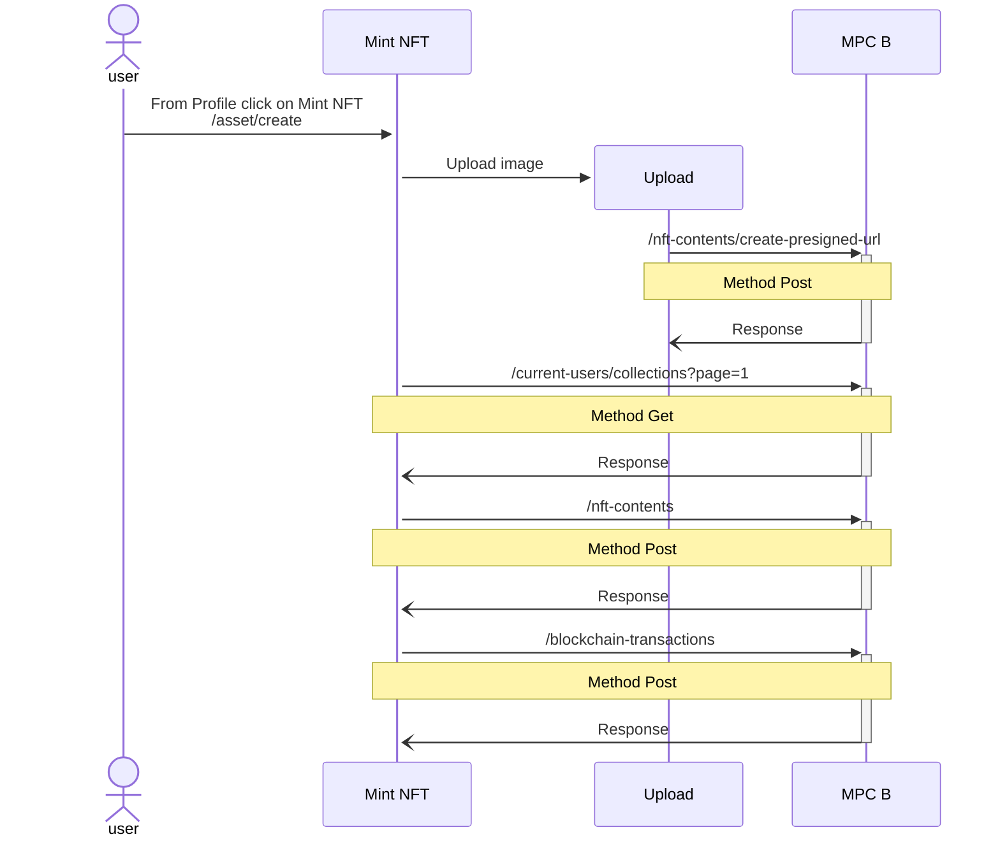

```mermaid
sequenceDiagram
    actor user
    participant M as Mint NFT
    
    user->>+ M:From Profile click on Mint NFT <br/> /asset/create
    create participant U as Upload
    M ->>U:Upload image
    U->>+B:/nft-contents/create-presigned-url 
    Note over U,B:Method Post
    B -)-U:Response
    participant B as MPC B
    M->>+B:/current-users/collections?page=1
    Note over M,B:Method Get
    B -)-M:Response
    M->>+B: /nft-contents
    Note over M,B:Method Post
    B -)-M:Response
    M->>+B:/blockchain-transactions
    Note over M,B:Method Post
    B -)-M:Response
```