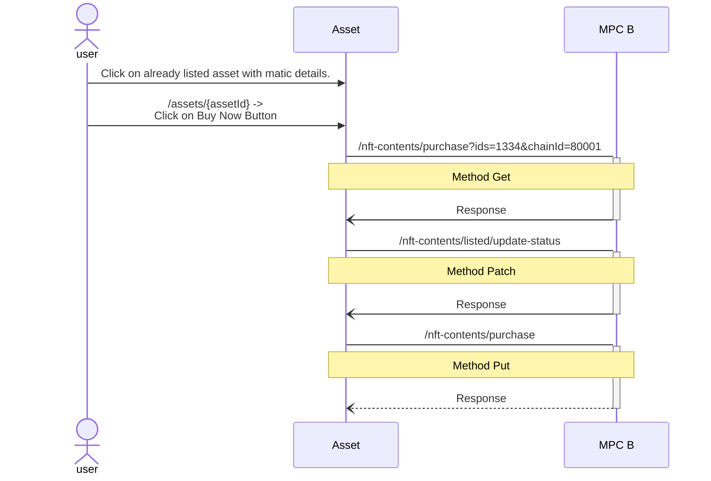

```mermaid
sequenceDiagram
    actor user
    participant A as Asset
    Participant B as MPC B
    user ->> A:Click on already listed asset with matic details.
    user ->>A:/assets/{assetId} -><br/>Click on Buy Now Button

    A->+B: /nft-contents/purchase?ids=1334&chainId=80001
    Note over A,B:Method Get
    B -)-A:Response

    A->+B:/nft-contents/listed/update-status
    Note over A,B:Method Patch   
    B -)-A:Response

    A->+B:/nft-contents/purchase
    Note over A,B:Method Put
    B --)-A:Response
       
    

      
```