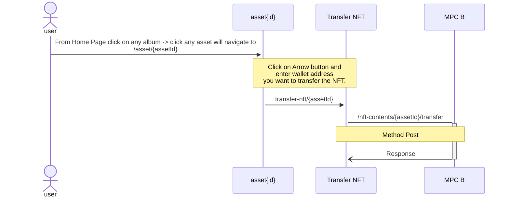

```mermaid
sequenceDiagram
    actor user
    participant A as asset{id}
    participant T as Transfer NFT
    participant B as MPC B
    user->>+A:From Home Page click on any album -> click any asset will navigate to <br/> /asset/{assetId}
    Note over A,T:Click on Arrow button and <br/> enter wallet address <br/>you want to transfer the NFT.
    A->>+T:transfer-nft/{assetId}
    T ->+B: /nft-contents/{assetId}/transfer
    Note over T,B:Method Post
    B -)-T:Response
    
```