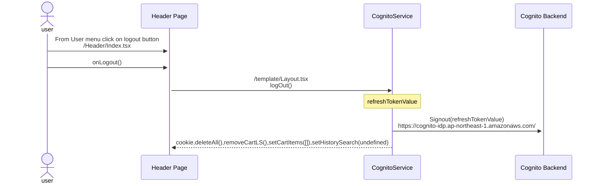

```mermaid

sequenceDiagram
    actor user
  
    participant P as Header Page
    participant S as CognitoService
    participant C as Cognito Backend
    user->>+P: From User menu click on logout button <br/> /Header/Index.tsx
    user ->>P:onLogout()
    P->>S: /template/Layout.tsx<br/>logOut()
    Note over S:refreshTokenValue
    S ->>+C:Signout(refreshTokenValue)<br/>https://cognito-idp.ap-northeast-1.amazonaws.com/
    S-->>P:cookie.deleteAll(),removeCartLS(),setCartItems([]),setHistorySearch(undefined)


```