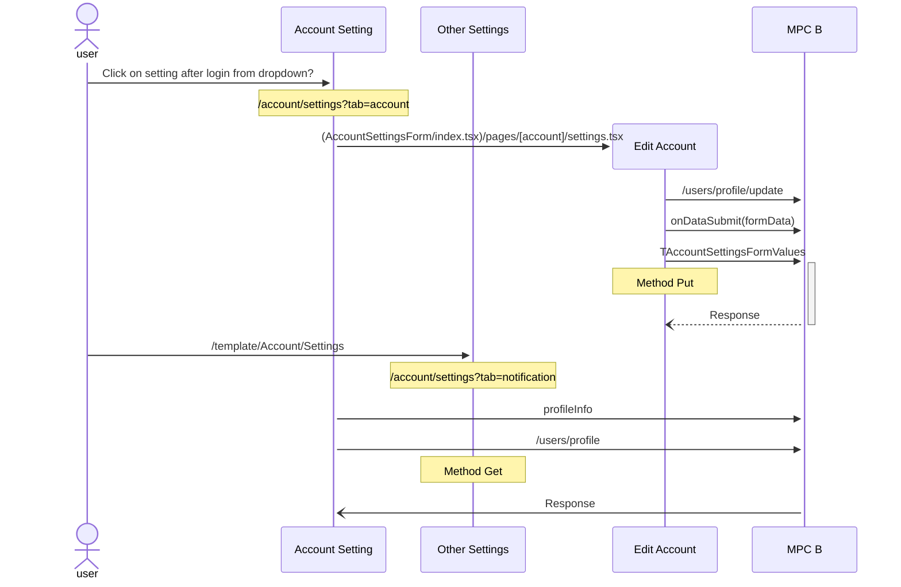

```mermaid
sequenceDiagram
    actor user
    participant A as Account Setting
    participant O as Other Settings
    
    user->>+A: Click on setting after login from dropdown?
    Note over A:/account/settings?tab=account
    create participant E as Edit Account
    A ->>E:(AccountSettingsForm/index.tsx)/pages/[account]/settings.tsx
    
    E->>+B: /users/profile/update
    E ->>+B:onDataSubmit(formData)
    E ->>+B:TAccountSettingsFormValues
    Note over E:Method Put
    B --)-E:Response
    user->>+O:/template/Account/Settings
    Note over O:/account/settings?tab=notification
    A->>+B:profileInfo
    A ->>+B: /users/profile
    Note over O:Method Get
    B -)+A: Response
    participant B as MPC B
    

    
    
   
```